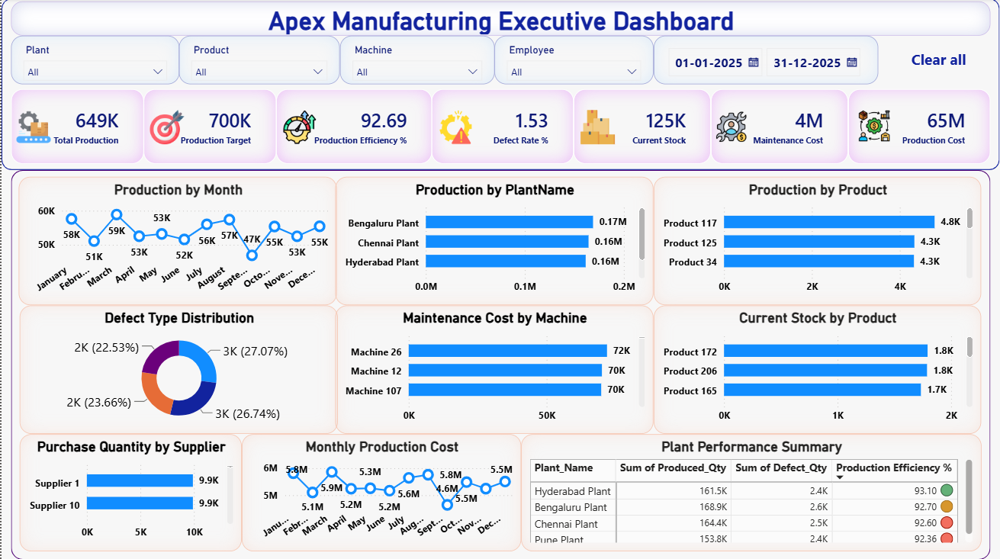
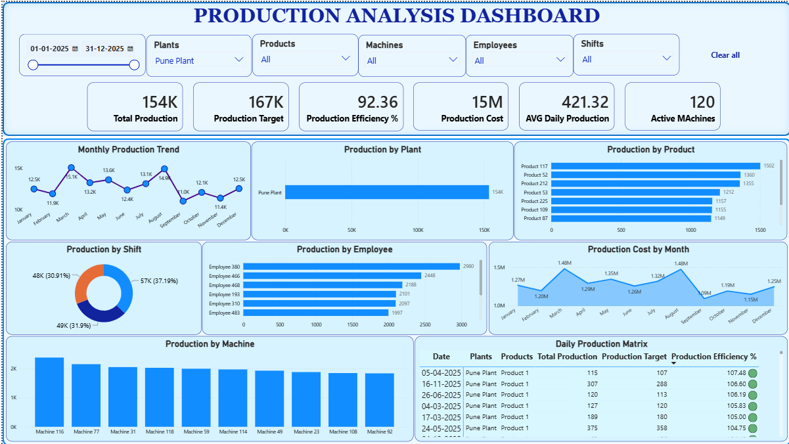
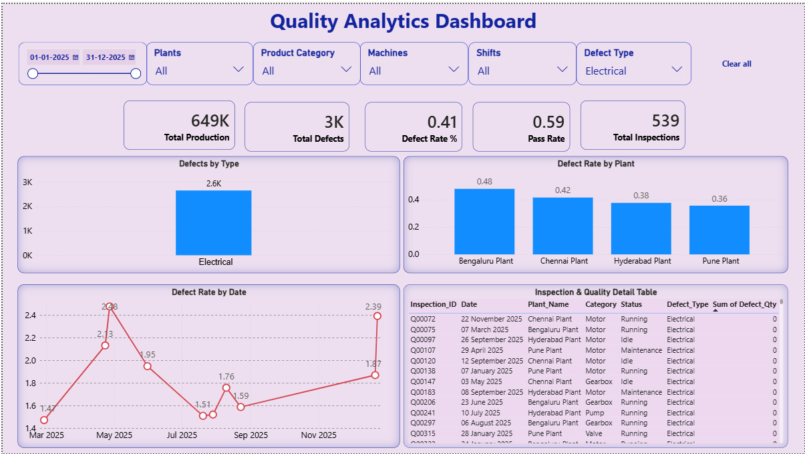
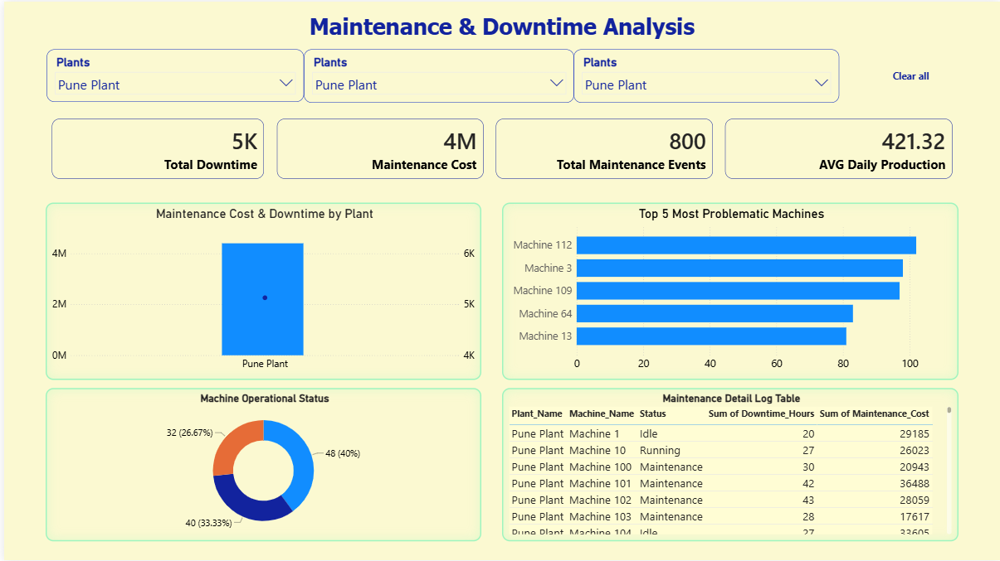
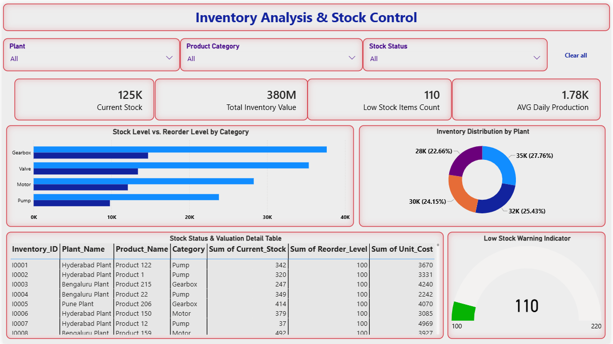
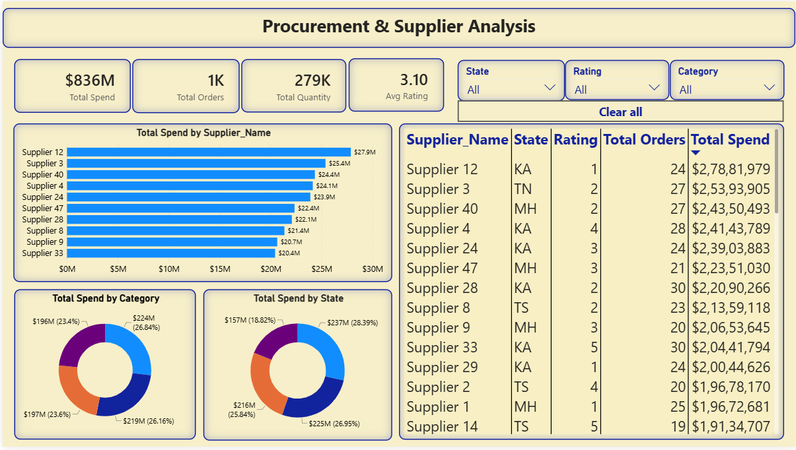

# 🏭 Apex Manufacturing Dashboard

<div align="center">

### 📊 Enterprise Business Intelligence Solution for Manufacturing Performance Analytics

Transforming manufacturing operations into actionable business insights using **Microsoft Power BI**, **DAX**, **Power Query**, and **Star Schema Data Modeling**.

<br>


</div>

---

# 📌 Project Overview

Manufacturing organizations generate large volumes of operational data every day from production lines, quality inspections, procurement, inventory, suppliers, employees, and machine maintenance. Without centralized reporting, decision-makers often struggle to monitor business performance efficiently.

The **Apex Manufacturing Executive Dashboard** is a comprehensive Business Intelligence solution built with **Microsoft Power BI** that transforms raw manufacturing data into interactive dashboards and meaningful business insights.

The dashboard enables executives, plant managers, and operations teams to monitor manufacturing performance, evaluate operational efficiency, analyze production trends, identify quality issues, optimize inventory, and improve procurement planning through real-time visual analytics.

This project demonstrates the complete Business Intelligence lifecycle, including:

- Business Requirement Analysis
- Data Collection
- Data Cleaning & Transformation
- Data Modeling (Star Schema)
- DAX Measure Development
- Interactive Dashboard Design
- KPI Development
- Business Insight Generation

---

# 🎯 Business Problem

Manufacturing companies often face several operational challenges that impact productivity and profitability.

### Major Challenges

- Limited visibility into production performance
- Difficulty tracking manufacturing KPIs
- High machine downtime
- Increasing maintenance costs
- Inventory shortages
- Procurement delays
- Product quality issues
- Manual reporting processes
- Slow executive decision-making

These challenges reduce operational efficiency and make strategic planning more difficult.

---

# 💼 Business Objectives

The primary objective of this project is to develop a centralized executive dashboard that enables stakeholders to monitor manufacturing performance through interactive visual analytics.

### Objectives

- Build an executive-level manufacturing dashboard
- Monitor production performance across plants
- Track production efficiency
- Analyze product quality
- Evaluate machine performance
- Monitor maintenance activities
- Analyze inventory availability
- Measure procurement performance
- Track supplier performance
- Enable interactive filtering and drill-down analysis
- Support strategic business decision-making

---

# ⭐ Project Highlights

| Feature | Description |
|----------|-------------|
| 📊 Executive Dashboard | High-level business overview |
| 🏭 Production Analytics | Production monitoring across plants |
| ⚙ Maintenance Analytics | Machine health and downtime |
| 📦 Inventory Analytics | Inventory stock monitoring |
| 🛒 Procurement Analytics | Supplier and purchase analysis |
| ✅ Quality Analytics | Defect monitoring and quality trends |
| 📈 KPI Dashboard | Executive performance indicators |
| 🎯 Interactive Filters | Dynamic report exploration |
| 🔍 Drill-Down Analysis | Detailed operational insights |
| ⭐ Star Schema | Optimized data model |

---

# 🛠 Technology Stack

| Technology | Purpose |
|------------|---------|
| Microsoft Power BI | Dashboard Development |
| Power Query | ETL & Data Cleaning |
| DAX | KPI Calculations |
| Microsoft Excel | Source Data |
| Data Modeling | Star Schema |
| SQL | Data Analysis |
| Git | Version Control |
| GitHub | Project Repository |

---

# 🏗 Solution Architecture

```text
                  Manufacturing Data Sources
                           │
      ┌────────────────────┼────────────────────┐
      │                    │                    │
 Production          Inventory          Procurement
      │                    │                    │
      └──────────────┬─────┴──────────────┬─────┘
                     │
             Power Query (ETL)
                     │
                     ▼
          Data Cleaning & Transformation
                     │
                     ▼
             Star Schema Data Model
                     │
                     ▼
               DAX Calculations
                     │
                     ▼
          Interactive Power BI Dashboard
                     │
                     ▼
            Business Insights & KPIs
```

---

# 📂 Dataset Overview

The dashboard integrates multiple manufacturing datasets representing various operational departments.

## Data Sources

| Dataset | Description |
|----------|-------------|
| Production | Manufacturing production records |
| Product Master | Product information |
| Plant | Manufacturing plant details |
| Employees | Employee information |
| Machines | Machine information |
| Inventory | Inventory stock |
| Procurement | Purchase records |
| Suppliers | Supplier information |
| Maintenance | Machine maintenance logs |
| Quality | Product quality inspections |

---

# 📊 Dataset Summary

| Dataset | Approximate Records |
|----------|-------------------:|
| Production | 5,000 |
| Quality | 2,000 |
| Inventory | 500 |
| Maintenance | 800 |
| Procurement | 1,000 |
| Products | 250 |
| Employees | 500 |
| Machines | 120 |
| Suppliers | 50 |
| Plants | 4 |

---

# 🎯 Business KPIs

The dashboard tracks key manufacturing performance indicators.

| KPI | Description |
|------|-------------|
| Total Production | Total units manufactured |
| Production Target | Planned production output |
| Production Efficiency % | Actual vs Target production |
| Defective Units | Total defective products |
| Defect Rate % | Manufacturing quality |
| Inventory Stock | Current inventory |
| Maintenance Cost | Maintenance expenditure |
| Procurement Cost | Purchasing expenditure |
| Purchase Orders | Procurement volume |
| Machine Availability | Machine utilization |
| Supplier Count | Active suppliers |
| Employee Productivity | Workforce performance |

---
# 📊 Dashboard Overview

The Apex Manufacturing Executive Dashboard consists of **six interactive report pages**, each designed to provide executives and operational managers with actionable insights into different business functions.

---

# 🖥 Dashboard Navigation

| Dashboard | Purpose |
|------------|----------|
| 🏠 Executive Dashboard | Overall Manufacturing Performance |
| 🏭 Production Analysis | Production Monitoring & Efficiency |
| ✅ Quality Analysis | Defect & Quality Monitoring |
| ⚙ Maintenance Analysis | Machine Health & Downtime |
| 📦 Inventory Analysis | Inventory & Stock Management |
| 🚚 Procurement Analysis | Supplier & Procurement Performance |

---

# 📸 Dashboard Preview

## 🏠 Executive Dashboard

> Provides an executive-level overview of manufacturing performance through interactive KPIs and summary visualizations.

<p align="center">

</p>

### Executive KPIs

- Total Production
- Production Target
- Production Efficiency %
- Defective Units
- Inventory Stock
- Maintenance Cost

### Executive Visuals

- Production Trend
- Production by Plant
- Inventory Distribution
- Defect Analysis
- Procurement Cost
- Maintenance Cost Trend

---

## 🏭 Production Analysis

> Analyze production performance across plants, products, employees, and machines.

<p align="center">

</p>

### Production Analysis Includes

- Production Trend
- Production by Plant
- Production by Product
- Machine Performance
- Employee Productivity
- Monthly Production
- Daily Production
- Target vs Actual
- Production Variance

---

## ✅ Quality Analysis

> Monitor manufacturing quality using defect metrics and inspection reports.

<p align="center">

</p>

### Quality Analysis Includes

- Defect Rate
- Product Quality Trend
- Plant-wise Quality
- Product-wise Defects
- Inspection Status
- Root Cause Analysis
- Quality Performance
- Defective Units Trend

---

## ⚙ Maintenance Analysis

> Monitor machine maintenance activities, downtime, and maintenance expenses.

<p align="center">

</p>

### Maintenance Analysis Includes

- Maintenance Cost
- Downtime Analysis
- Machine Availability
- Preventive Maintenance
- Breakdown Analysis
- Machine Status
- Maintenance Trend
- Maintenance Frequency

---

## 📦 Inventory Analysis

> Track inventory availability and optimize stock management.

<p align="center">

</p>

### Inventory Analysis Includes

- Current Inventory
- Inventory Trend
- Product Inventory
- Stock Availability
- Stock Movement
- Low Stock Alert
- Inventory Distribution
- Inventory Utilization

---

## 🚚 Procurement Analysis

> Analyze supplier performance and procurement activities.

<p align="center">

</p>

### Procurement Analysis Includes

- Procurement Cost
- Purchase Orders
- Supplier Performance
- Procurement Trend
- Material Procurement
- Cost by Supplier
- Delivery Performance
- Purchase Distribution

---

# ⭐ Dashboard Features

The dashboard has been designed using modern Business Intelligence best practices.

| Feature | Description |
|----------|-------------|
| 🎯 KPI Cards | Executive-level KPIs |
| 📈 Trend Analysis | Monthly & Yearly Trends |
| 📊 Interactive Charts | Dynamic Visualizations |
| 🎛 Slicers | Interactive Filtering |
| 🔄 Cross Filtering | Visual Interaction |
| 🔍 Drill Down | Detailed Analysis |
| 📑 Tooltips | Additional Context |
| 📌 Bookmarks | Easy Navigation |
| 🎨 Conditional Formatting | Highlight Important Metrics |
| 📱 Responsive Layout | Executive Reporting Experience |

---

# 📐 Data Model

The project follows a **Star Schema** architecture for optimized report performance and simplified DAX calculations.

## ⭐ Fact Tables

| Fact Table | Description |
|------------|-------------|
| Fact Production | Manufacturing Production |
| Fact Quality | Product Quality |
| Fact Inventory | Inventory Records |
| Fact Maintenance | Maintenance Activities |
| Fact Procurement | Purchase Transactions |

---

## ⭐ Dimension Tables

| Dimension | Description |
|-----------|-------------|
| Dim Date | Calendar |
| Dim Plant | Manufacturing Plants |
| Dim Product | Product Information |
| Dim Employee | Employee Details |
| Dim Machine | Machine Information |
| Dim Supplier | Supplier Information |

---

## ⭐ Star Schema

<p align="center">

</p>

### Benefits

- Faster report performance
- Reduced model complexity
- Better scalability
- Simplified DAX calculations
- Efficient filtering
- Optimized memory usage

---

# ⚡ Power BI Features Used

### Data Preparation

- Power Query
- Data Cleaning
- Data Transformation
- Data Validation
- Data Profiling
- Data Loading

---

### Data Modeling

- Star Schema
- Relationships
- Cardinality Management
- Date Table
- Dimension Tables
- Fact Tables

---

### DAX

- Measures
- Calculated Columns
- Variables
- DIVIDE()
- CALCULATE()
- FILTER()
- SUMX()
- AVERAGEX()
- SWITCH()
- IF()
- Time Intelligence

---

### Visualization

- KPI Cards
- Line Charts
- Bar Charts
- Column Charts
- Donut Charts
- Matrix
- Tables
- Cards
- Slicers
- Buttons

---

### User Experience

- Navigation Buttons
- Bookmarks
- Drill Down
- Cross Filtering
- Tooltips
- Dynamic Titles
- Conditional Formatting
- Report Filters
- Page Navigation

---

# 📈 DAX Measures

The dashboard utilizes **Data Analysis Expressions (DAX)** to calculate key business metrics and enable dynamic reporting.

## Core Measures

| Measure | Purpose |
|----------|----------|
| Total Production | Total manufactured units |
| Production Target | Planned production |
| Production Efficiency % | Actual vs Target |
| Defective Units | Total defective products |
| Defect Rate % | Product quality metric |
| Inventory Stock | Current inventory level |
| Maintenance Cost | Total maintenance expense |
| Procurement Cost | Purchasing expenditure |
| Purchase Orders | Number of purchase orders |
| Supplier Count | Total suppliers |
| Machine Availability % | Machine utilization |
| Employee Productivity | Employee performance |

---

# 📊 Business Insights

The dashboard enables executives and operational managers to quickly identify operational trends and business opportunities.

## Production Insights

- Monitor manufacturing performance across all plants.
- Compare actual production against production targets.
- Identify high-performing production facilities.
- Detect production bottlenecks.
- Analyze monthly production trends.

---

## Quality Insights

- Monitor manufacturing defect rates.
- Identify products with the highest defects.
- Compare quality performance across plants.
- Track inspection trends.
- Reduce production waste.

---

## Maintenance Insights

- Monitor maintenance expenditure.
- Identify machines with frequent failures.
- Track preventive maintenance schedules.
- Analyze downtime trends.
- Improve machine availability.

---

## Inventory Insights

- Monitor stock availability.
- Detect low inventory products.
- Analyze inventory movement.
- Improve inventory planning.
- Reduce stock shortages.

---

## Procurement Insights

- Evaluate supplier performance.
- Monitor procurement costs.
- Analyze purchasing trends.
- Improve procurement efficiency.
- Optimize supplier relationships.

---

# 💼 Business Value

The dashboard delivers measurable value across multiple business functions.

| Business Area | Value Delivered |
|---------------|----------------|
| Production | Increased operational visibility |
| Quality | Reduced manufacturing defects |
| Inventory | Improved stock management |
| Maintenance | Reduced downtime |
| Procurement | Better supplier performance |
| Executive Management | Faster decision making |

---

# 🚀 Skills Demonstrated

This project showcases end-to-end Business Intelligence development skills.

## Business Analysis

- Business Requirement Gathering
- KPI Identification
- Executive Reporting
- Data Interpretation
- Business Insight Generation

---

## Data Preparation

- Data Cleaning
- Data Transformation
- Data Validation
- Data Profiling
- Power Query

---

## Data Modeling

- Star Schema
- Fact Tables
- Dimension Tables
- Relationship Management
- Performance Optimization

---

## DAX

- Measures
- Calculated Columns
- Variables
- Context Transition
- Time Intelligence
- Aggregation Functions

---

## Dashboard Development

- KPI Cards
- Interactive Charts
- Dynamic Visualizations
- Bookmarks
- Drill Down
- Navigation Buttons
- Conditional Formatting
- Tooltips

---

## Business Intelligence

- Manufacturing Analytics
- Production Analytics
- Inventory Analytics
- Procurement Analytics
- Maintenance Analytics
- Executive Reporting

---

# 🔄 Project Workflow

```text
Business Requirements
          │
          ▼
Data Collection
          │
          ▼
Data Cleaning
          │
          ▼
Power Query
          │
          ▼
Data Transformation
          │
          ▼
Star Schema Modeling
          │
          ▼
Relationship Creation
          │
          ▼
DAX Measure Development
          │
          ▼
Dashboard Design
          │
          ▼
Testing & Validation
          │
          ▼
Business Insights
          │
          ▼
Executive Dashboard
```

---

# 📁 Repository Structure

```text
apex-manufacturing-executive-dashboard
│
├── Dashboard
│   └── Apex_Manufacturing_Executive_Dashboard.pbix
│
├── Dataset
│   ├── Production.xlsx
│   ├── Inventory.xlsx
│   ├── Quality.xlsx
│   ├── Maintenance.xlsx
│   ├── Procurement.xlsx
│   ├── Products.xlsx
│   ├── Employees.xlsx
│   ├── Machines.xlsx
│   ├── Plants.xlsx
│   └── Suppliers.xlsx
│
├── Images
│   ├── executive_dashboard.png
│   ├── production_analysis.png
│   ├── quality_analysis.png
│   ├── maintenance_analysis.png
│   ├── inventory_analysis.png
│   ├── procurement_analysis.png
│   ├── dashboard_preview.png
│   └── data_model.png
│
├── Documentation
│   ├── Business_Requirements.pdf
│   ├── Data_Dictionary.pdf
│   ├── KPI_Documentation.pdf
│   ├── Data_Model.pdf
│   ├── Data_Cleaning_Report.pdf
│   └── Project_Report.pdf
│
├── README.md
├── LICENSE
└── .gitignore
```

---

# 📥 Installation Guide

## Clone Repository

```bash
git clone https://github.com/your-username/apex-manufacturing-executive-dashboard.git
```

---

## Open Power BI Report

Navigate to:

```text
Dashboard/
└── Apex_Manufacturing_Executive_Dashboard.pbix
```

Open the `.pbix` file using **Microsoft Power BI Desktop**.

---

## Requirements

- Microsoft Power BI Desktop
- Microsoft Excel
- Windows 10/11

---

# 📖 Documentation

The repository includes complete project documentation.

| Document | Description |
|-----------|-------------|
| Business Requirements | Client requirements |
| Data Dictionary | Dataset metadata |
| KPI Documentation | KPI definitions |
| Data Model | Star Schema |
| Data Cleaning Report | ETL process |
| Project Report | Complete project documentation |

---

# 📊 Performance Optimization

The report has been optimized using Power BI best practices.

- Star Schema Data Model
- Optimized Relationships
- Efficient DAX Measures
- Reduced Data Redundancy
- Optimized Visual Interactions
- Clean Power Query Transformations
- Proper Data Types
- Report Performance Optimization

---
---

# 🔮 Future Enhancements

This project has been designed with scalability in mind. The following enhancements can be implemented in future versions to further improve functionality and business value.

## Planned Improvements

### ☁ Power BI Service Deployment
- Publish reports to Power BI Service
- Secure cloud-based dashboard access
- Workspace collaboration

---

### 🔄 Scheduled Data Refresh

- Automated daily refresh
- Live business reporting
- Reduced manual effort

---

### 🔐 Row-Level Security (RLS)

- Department-level access
- Plant-wise permissions
- Executive security roles
- Data governance

---

### 📱 Mobile Dashboard

- Responsive mobile layout
- Executive mobile reporting
- Optimized navigation

---

### 📊 Forecasting

- Production Forecast
- Inventory Forecast
- Maintenance Forecast
- Procurement Forecast

---

### 🤖 AI-Powered Analytics

- AI Visuals
- Key Influencers
- Decomposition Tree
- Smart Narratives
- Anomaly Detection

---

### 📈 What-If Analysis

- Production Planning
- Cost Simulation
- Inventory Planning
- Demand Forecasting

---

### 🚨 Alerts & Notifications

- Low Inventory Alerts
- High Defect Alerts
- Machine Downtime Alerts
- Production Target Alerts

---

### 🌐 Real-Time Reporting

- SQL Server Integration
- Azure Data Factory
- IoT Manufacturing Sensors
- Live Production Dashboard

---

# 🎯 Key Learnings

During this project, the following Business Intelligence concepts were applied and strengthened:

- Business Requirement Analysis
- Manufacturing Domain Understanding
- Data Cleaning using Power Query
- Data Transformation
- Data Modeling
- Star Schema Design
- Relationship Management
- DAX Measure Development
- KPI Design
- Interactive Dashboard Development
- Performance Optimization
- Business Storytelling
- Executive Reporting
- Git & GitHub Project Management

---

# 🏆 Skills Demonstrated

## Business Intelligence

- Dashboard Design
- KPI Development
- Executive Reporting
- Interactive Analytics
- Business Storytelling

---

## Power BI

- Power Query
- Data Modeling
- Relationships
- DAX
- Measures
- Calculated Columns
- Drill Down
- Bookmarks
- Navigation Buttons
- Conditional Formatting
- Tooltips

---

## Data Analytics

- Data Cleaning
- Data Transformation
- Data Validation
- Data Analysis
- Business Analysis
- Data Visualization

---

## Technical Skills

- Microsoft Power BI
- Microsoft Excel
- SQL
- DAX
- Power Query
- Git
- GitHub

---

# 🤝 Contributing

Contributions are welcome!

If you have suggestions for improving this project, feel free to:

1. Fork the repository
2. Create a new feature branch
3. Commit your changes
4. Push the branch
5. Open a Pull Request

Your feedback and contributions are greatly appreciated.

---

# 📥 Getting Started

## Prerequisites

Before opening this project, ensure you have:

- Microsoft Power BI Desktop
- Microsoft Excel
- Git (Optional)

---

## Clone the Repository

```bash
git clone https://github.com/your-username/apex-manufacturing-executive-dashboard.git
```

---

## Open the Dashboard

```text
Dashboard/
└── Apex_Manufacturing_Executive_Dashboard.pbix
```

---

## Explore the Dashboard

Use the available slicers to filter data by:

- Date
- Plant
- Product
- Machine
- Department
- Supplier

Interact with visuals using:

- Cross Filtering
- Drill Down
- Tooltips
- Navigation Buttons

---

# 📂 Documentation

The project contains complete documentation to help understand the dashboard and underlying data model.

| Document | Purpose |
|----------|---------|
| Business Requirements | Defines business goals and reporting requirements |
| Data Dictionary | Describes all datasets and columns |
| KPI Documentation | Explains business KPIs and calculations |
| Data Model | Star Schema relationships |
| Data Cleaning Report | Data transformation process |
| Project Report | Complete project documentation |

---

# 📊 Project Summary

| Category | Details |
|----------|----------|
| Project Name | Apex Manufacturing Executive Dashboard |
| Domain | Manufacturing Analytics |
| Tool | Microsoft Power BI |
| Data Source | Microsoft Excel |
| Data Modeling | Star Schema |
| ETL | Power Query |
| KPI Language | DAX |
| Dashboard Pages | 6 |
| Primary Audience | Executives & Operations Managers |
| Report Type | Interactive Business Intelligence Dashboard |

---

# 👨‍💻 Author

## Chelimala Hemanth

**Aspiring Data Analyst | Power BI Developer | AI & Data Science Graduate**

### Technical Skills

- Microsoft Power BI
- SQL
- Python
- Microsoft Excel
- DAX
- Power Query
- Data Modeling
- Data Visualization
- Business Intelligence

---

### Connect With Me

> **GitHub:** https://github.com/hemanth2662777

> **LinkedIn:** *(Add Your LinkedIn URL)*

> **Email:** *(Add Your Email Address)*

---

# 🌟 Support

If you found this project helpful or inspiring:

⭐ Star this repository

🍴 Fork the repository

📝 Share your feedback

🤝 Connect with me on LinkedIn

Your support helps me continue building professional Business Intelligence and Data Analytics projects.

---

# 🙏 Acknowledgements

Special thanks to:

- Microsoft Power BI Community
- Microsoft Learn
- SQLBI
- Enterprise DNA
- GitHub
- Open-source Data Analytics Community

for providing valuable learning resources and best practices that contributed to this project.

---

# 📄 License

This project is licensed under the **MIT License**.

```text
MIT License

Copyright (c) 2026 Chelimala Hemanth

Permission is hereby granted, free of charge, to any person obtaining a copy
of this software and associated documentation files (the "Software"), to deal
in the Software without restriction, including without limitation the rights
to use, copy, modify, merge, publish, distribute, sublicense, and/or sell
copies of the Software, and to permit persons to whom the Software is furnished
to do so, subject to the following conditions:

The above copyright notice and this permission notice shall be included in all
copies or substantial portions of the Software.

THE SOFTWARE IS PROVIDED "AS IS", WITHOUT WARRANTY OF ANY KIND, EXPRESS OR
IMPLIED, INCLUDING BUT NOT LIMITED TO THE WARRANTIES OF MERCHANTABILITY,
FITNESS FOR A PARTICULAR PURPOSE AND NONINFRINGEMENT. IN NO EVENT SHALL THE
AUTHORS OR COPYRIGHT HOLDERS BE LIABLE FOR ANY CLAIM, DAMAGES OR OTHER
LIABILITY, WHETHER IN AN ACTION OF CONTRACT, TORT OR OTHERWISE, ARISING FROM,
OUT OF OR IN CONNECTION WITH THE SOFTWARE OR THE USE OR OTHER DEALINGS IN THE
SOFTWARE.
```

---

<div align="center">

## ⭐ If you like this project, don't forget to give it a Star!

**Thank you for visiting this repository.**

### 🚀 Happy Learning & Happy Analyzing!

Made with ❤️ using **Microsoft Power BI**

</div>
